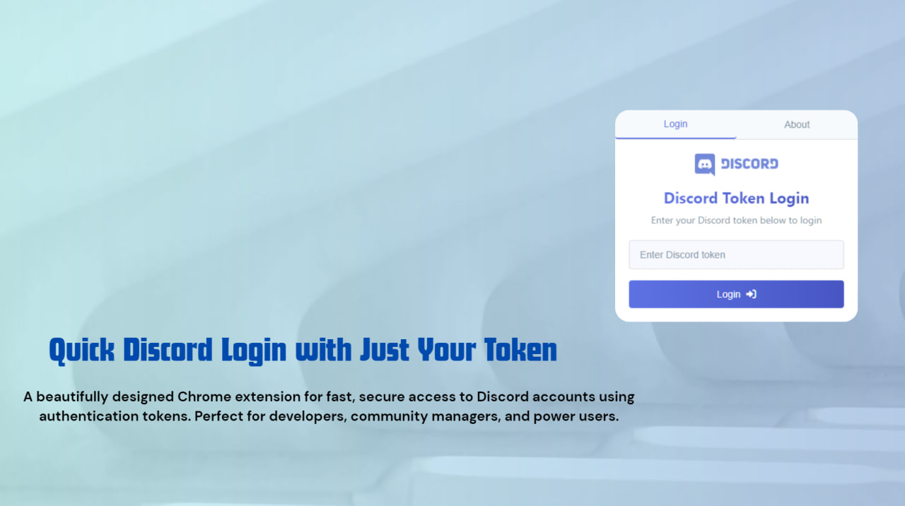

# Discord Token Login

  
   
   
  
  
  
  

 

  <b>A beautifully designed extension for quick Discord account access using tokens</b>

  

## ✨ Features

# Discord Token Login is a powerful browser extension that streamlines the process of logging into your Discord account using authentication tokens. Perfect for developers, community managers, and power users who need to manage multiple accounts efficiently.

- **🔐 Secure Token Login**: Log in to Discord with your authentication token without storing your password. This method bypasses the traditional login flow, making it ideal for quick account switching and API testing.

- **🛡️ Local Storage Only**: Your security is our priority. All tokens are stored locally on your device and are never transmitted to any external servers. This zero-data-collection approach ensures maximum privacy.

- **🎨 Beautiful User Interface**: Enjoy a modern, intuitive interface with a clean light theme and elegant gradients. The carefully crafted design makes token management a pleasure rather than a chore.

- **⚡ Fast Access**: Switch between multiple Discord accounts in seconds without the hassle of typing usernames and passwords repeatedly. Perfect for community managers who handle multiple servers.

- **🔄 Smart Tab Management**: The extension intelligently detects existing Discord tabs and updates them rather than creating new ones, helping you maintain a clean browser workspace.

- **📱 Responsive Design**: Whether you're using a laptop, desktop, or high-resolution display, the interface automatically adapts to provide the best experience on any screen size.

- **🔍 Simple Token Management**: Enter your token once and log in immediately. No complicated configuration or setup required.

## 📥 Installation

### Chrome Web Store - SOON ⚡

The easiest way to install Discord Token Login is through the official Chrome Web Store:

1. Visit the [Discord Token Login page](https://chrome.google.com/webstore/detail/discord-token-login) on the Chrome Web Store
2. Click the "Add to Chrome" button
3. Confirm the installation when prompted
4. The extension icon will appear in your browser toolbar, ready to use

### Manual Installation (For Developers)

If you prefer to install the extension manually or want to modify it for your needs:

1. Download the [latest release](https://github.com/HexQuant-hub/Discord-Token-Login/releases) ZIP file
2. Extract the contents to a folder on your computer
3. Open Chrome and navigate to `chrome://extensions/`
4. Enable "Developer mode" using the toggle in the top-right corner
5. Click "Load unpacked" and select the folder containing the extracted extension
6. The extension is now installed and ready to use

## 🚀 How to Use

Using Discord Token Login is straightforward and efficient:

1. **Obtain Your Token**: First, you'll need your Discord authentication token. This is a private key that provides access to your account.

2. **Open the Extension**: Click the Discord Token Login icon in your browser toolbar. A clean, intuitive popup will appear.

3. **Enter Your Token**: Type or paste your Discord token into the input field. The secure input ensures your token remains protected.

4. **Login**: Click the "Login" button or press Enter. The extension will process your token and securely log you into your Discord account.

5. **Enjoy Discord**: You'll be automatically redirected to Discord, already logged in and ready to chat, manage servers, or whatever you need to do.

  

## ⚠️ Security Considerations

Your Discord token provides complete access to your account. To ensure your account remains secure:

- **Never share your token** with anyone, under any circumstances
- **Do not enter your token** on websites or applications you don't trust
- **Regularly rotate your token** if you use it for sensitive operations
- **Log out from Discord** when using shared or public computers
- **Enable Two-Factor Authentication** on your Discord account for an extra layer of security

If you suspect your token has been compromised, immediately change your Discord password, which will invalidate all existing tokens.

## 🔒 Privacy Policy

We take your privacy extremely seriously. Discord Token Login:

- **Collects no data whatsoever** - We have a strict no-logging policy
- **Stores tokens locally** - All data remains exclusively on your device
- **Requires minimal permissions** - We only request the "tabs" permission to manage Discord windows
- **Contains no trackers** - No analytics, no telemetry, no data collection
- **Uses no external services** - All operations happen locally on your device

For full details, please see our [Privacy Policy](PRIVACY_POLICY.md).

## 👥 Development Team

Discord Token Login is developed and maintained by a dedicated team of professionals:

  <table>
    <tr>
      <td align="center">
        
        
Lead Developer

      </td>
      <td align="center">
        
        
Project Manager

      </td>
      <td align="center">
        
        
Organization

      </td>
    </tr>
  </table>

We welcome contributions, feedback, and feature requests! Feel free to open an issue or submit a pull request on our GitHub repository.

## 🛠️ Technical Details

Discord Token Login leverages modern web technologies to provide a seamless experience:

- **Modern JavaScript (ES6+)**: Clean, efficient code using the latest ECMAScript features
- **Chrome Extension Manifest V3**: Compliant with the latest browser extension standards
- **Token-based Authentication**: Utilizing Discord's authentication system for secure access
- **CSS Variables and Flexbox**: For responsive, adaptive layouts across all screen sizes
- **Local Storage API**: For secure, client-side data management
- **Chrome Tabs API**: For intelligent tab management and navigation

Developers interested in the internal workings can explore our [source code](https://github.com/HexQuant-hub/Discord-Token-Login) on GitHub.

## 📜 License

This project is licensed under the MIT License - see the [LICENSE](LICENSE) file for full details. This permissive license allows you to use, modify, and distribute this software freely, provided attribution is maintained.

## Disclaimer

Discord Token Login is an independent project and is not affiliated with, endorsed by, or connected to Discord Inc. in any way. All Discord logos and trademarks are the property of Discord Inc.

This extension is provided "as is", without warranty of any kind. While we strive to ensure security and reliability, users are responsible for their own actions and data.

---

  <b>افزونه‌ای زیبا برای دسترسی سریع به حساب دیسکورد با استفاده از توکن</b>

## ✨ ویژگی‌ها

# افزونه Discord Token Login یک ابزار قدرتمند برای مرورگر است که فرآیند ورود به حساب دیسکورد شما را با استفاده از توکن‌های احراز هویت تسهیل می‌کند. ایده‌آل برای توسعه‌دهندگان، مدیران جامعه و کاربران حرفه‌ای که نیاز به مدیریت چندین حساب کاربری به صورت کارآمد دارند.

- **🔐 ورود امن با توکن**: با استفاده از توکن احراز هویت خود وارد دیسکورد شوید بدون اینکه رمز عبورتان ذخیره شود. این روش فرآیند سنتی ورود را دور می‌زند و آن را برای تعویض سریع حساب و تست API ایده‌آل می‌سازد.

- **🛡️ ذخیره‌سازی محلی**: امنیت شما اولویت ماست. تمام توکن‌ها به صورت محلی روی دستگاه شما ذخیره می‌شوند و هرگز به هیچ سرور خارجی منتقل نمی‌شوند. این رویکرد بدون جمع‌آوری داده، حداکثر حریم خصوصی را تضمین می‌کند.

- **🎨 رابط کاربری زیبا**: از یک رابط مدرن و شهودی با تم روشن و گرادیان‌های ظریف لذت ببرید. طراحی دقیق ما مدیریت توکن را به تجربه‌ای لذت‌بخش تبدیل می‌کند.

- **⚡ دسترسی سریع**: در عرض چند ثانیه بین چندین حساب دیسکورد جابجا شوید بدون دردسر تایپ مکرر نام کاربری و رمز عبور. ایده‌آل برای مدیران جامعه که چندین سرور را مدیریت می‌کنند.

- **🔄 مدیریت هوشمند تب‌ها**: افزونه به طور هوشمند تب‌های موجود دیسکورد را شناسایی کرده و آنها را به‌روزرسانی می‌کند، به جای ایجاد تب‌های جدید، که به شما کمک می‌کند فضای کاری مرورگر خود را تمیز نگه دارید.

- **📱 طراحی واکنش‌گرا**: چه از لپ‌تاپ استفاده کنید، چه دسکتاپ یا نمایشگر با وضوح بالا، رابط به طور خودکار تنظیم می‌شود تا بهترین تجربه را در هر اندازه صفحه نمایش ارائه دهد.

- **🔍 مدیریت ساده توکن**: توکن خود را یک بار وارد کنید و بلافاصله وارد شوید. بدون نیاز به پیکربندی یا راه‌اندازی پیچیده.

## 📥 نصب

### فروشگاه کروم - بزودی⚡

ساده‌ترین راه برای نصب Discord Token Login از طریق فروشگاه رسمی کروم است:

1. از [صفحه Discord Token Login](https://chrome.google.com/webstore/detail/discord-token-login) در فروشگاه کروم بازدید کنید
2. روی دکمه "افزودن به کروم" کلیک کنید
3. هنگامی که درخواست شد، نصب را تأیید کنید
4. آیکون افزونه در نوار ابزار مرورگر شما ظاهر می‌شود، آماده استفاده

### نصب دستی (برای توسعه‌دهندگان)

اگر ترجیح می‌دهید افزونه را به صورت دستی نصب کنید یا می‌خواهید آن را برای نیازهای خود تغییر دهید:

1. فایل ZIP [آخرین نسخه](https://github.com/HexQuant-hub/Discord-Token-Login/releases) را دانلود کنید
2. محتویات را به یک پوشه در کامپیوتر خود استخراج کنید
3. کروم را باز کنید و به `chrome://extensions/` بروید
4. "حالت توسعه‌دهنده" را با استفاده از دکمه در گوشه بالا-راست فعال کنید
5. روی "بارگذاری برنامه باز نشده" کلیک کنید و پوشه حاوی افزونه استخراج شده را انتخاب کنید
6. افزونه اکنون نصب شده و آماده استفاده است

## 🚀 نحوه استفاده

استفاده از Discord Token Login ساده و کارآمد است:

1. **دریافت توکن خود**: ابتدا، شما به توکن احراز هویت دیسکورد خود نیاز دارید. این یک کلید خصوصی است که دسترسی به حساب شما را فراهم می‌کند.

2. **باز کردن افزونه**: روی آیکون Discord Token Login در نوار ابزار مرورگر خود کلیک کنید. یک پاپ‌آپ تمیز و شهودی ظاهر می‌شود.

3. **وارد کردن توکن**: توکن دیسکورد خود را در فیلد ورودی تایپ یا کپی کنید. ورودی امن اطمینان می‌دهد که توکن شما محافظت می‌شود.

4. **ورود**: روی دکمه "ورود" کلیک کنید یا کلید Enter را فشار دهید. افزونه توکن شما را پردازش کرده و شما را به صورت امن وارد حساب دیسکورد خود می‌کند.

5. **از دیسکورد لذت ببرید**: شما به طور خودکار به دیسکورد هدایت می‌شوید، از قبل وارد شده و آماده چت، مدیریت سرورها یا هر کاری که نیاز دارید انجام دهید.

## ⚠️ ملاحظات امنیتی

توکن دیسکورد شما دسترسی کامل به حساب شما را فراهم می‌کند. برای اطمینان از امنیت حساب خود:

- **هرگز توکن خود را با هیچ کس** تحت هیچ شرایطی به اشتراک نگذارید
- **توکن خود را در وب‌سایت‌ها یا برنامه‌هایی که به آنها اعتماد ندارید وارد نکنید**
- **اگر از آن برای عملیات حساس استفاده می‌کنید، توکن خود را به طور منظم تغییر دهید**
- **هنگام استفاده از کامپیوترهای مشترک یا عمومی از دیسکورد خارج شوید**
- **احراز هویت دو مرحله‌ای را در حساب دیسکورد خود فعال کنید** تا یک لایه امنیتی اضافی داشته باشید

اگر مشکوک هستید که توکن شما به خطر افتاده است، فوراً رمز عبور دیسکورد خود را تغییر دهید، که تمام توکن‌های موجود را نامعتبر می‌کند.

## 🔒 سیاست حفظ حریم خصوصی

ما حریم خصوصی شما را بسیار جدی می‌گیریم. Discord Token Login:

- **هیچ داده‌ای جمع‌آوری نمی‌کند** - ما سیاست عدم ثبت وقایع داریم
- **توکن‌ها را به صورت محلی ذخیره می‌کند** - تمام داده‌ها منحصراً روی دستگاه شما باقی می‌مانند
- **نیاز به حداقل مجوزها دارد** - ما فقط مجوز "tabs" را برای مدیریت پنجره‌های دیسکورد درخواست می‌کنیم
- **بدون ردیاب** - بدون تجزیه و تحلیل، بدون سنجش از راه دور، بدون جمع‌آوری داده
- **از هیچ سرویس خارجی استفاده نمی‌کند** - تمام عملیات‌ها به صورت محلی روی دستگاه شما انجام می‌شوند

برای جزئیات کامل، لطفاً [سیاست حفظ حریم خصوصی](PRIVACY_POLICY.md) ما را ببینید.

## 👥 تیم توسعه

Discord Token Login توسط تیمی متعهد از متخصصان توسعه و نگهداری می‌شود:

  <table>
    <tr>
      <td align="center">
        
        
توسعه‌دهنده اصلی

      </td>
      <td align="center">
        
        
مدیر پروژه

      </td>
      <td align="center">
        
        
سازمان

      </td>
    </tr>
  </table>

ما از مشارکت‌ها، بازخوردها و درخواست‌های ویژگی استقبال می‌کنیم! لطفاً در مخزن گیت‌هاب ما یک مسئله باز کنید یا یک درخواست پول ارسال کنید.

## 🛠️ جزئیات فنی

Discord Token Login از فناوری‌های مدرن وب برای ارائه یک تجربه یکپارچه استفاده می‌کند:

- **جاوااسکریپت مدرن (ES6+)**: کد تمیز و کارآمد با استفاده از آخرین ویژگی‌های ECMAScript
- **Chrome Extension Manifest V3**: مطابق با آخرین استانداردهای افزونه مرورگر
- **احراز هویت مبتنی بر توکن**: استفاده از سیستم احراز هویت دیسکورد برای دسترسی امن
- **متغیرهای CSS و Flexbox**: برای طرح‌بندی‌های واکنش‌گرا و تطبیق‌پذیر در تمام اندازه‌های صفحه نمایش
- **API ذخیره‌سازی محلی**: برای مدیریت امن داده‌ها در سمت کاربر
- **API تب‌های کروم**: برای مدیریت هوشمند تب و ناوبری

توسعه‌دهندگان علاقه‌مند به عملکرد داخلی می‌توانند [کد منبع](https://github.com/HexQuant-hub/Discord-Token-Login) ما را در گیت‌هاب بررسی کنند.

## 📜 مجوز

این پروژه تحت مجوز MIT منتشر شده است - برای جزئیات کامل، [LICENSE](LICENSE) را ببینید. این مجوز آزاد به شما اجازه می‌دهد این نرم‌افزار را آزادانه استفاده، تغییر و توزیع کنید، مشروط بر اینکه اعتبار حفظ شود.

## سلب مسئولیت

Discord Token Login یک پروژه مستقل است و به هیچ وجه وابسته به، تأیید شده توسط، یا متصل به Discord Inc نیست. تمام لوگوها و علائم تجاری دیسکورد متعلق به Discord Inc است.

این افزونه "همانطور که هست" ارائه می‌شود، بدون هیچ گونه ضمانتی. در حالی که ما تلاش می‌کنیم امنیت و قابلیت اطمینان را تضمین کنیم، کاربران مسئول اقدامات و داده‌های خود هستند.

---

  
ساخته شده با ❤️ توسط تیم HexQuant

  
  
   
  © 2025 HexQuant. All rights reserved.

